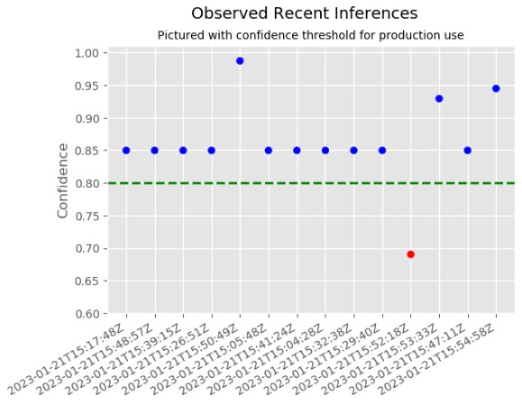
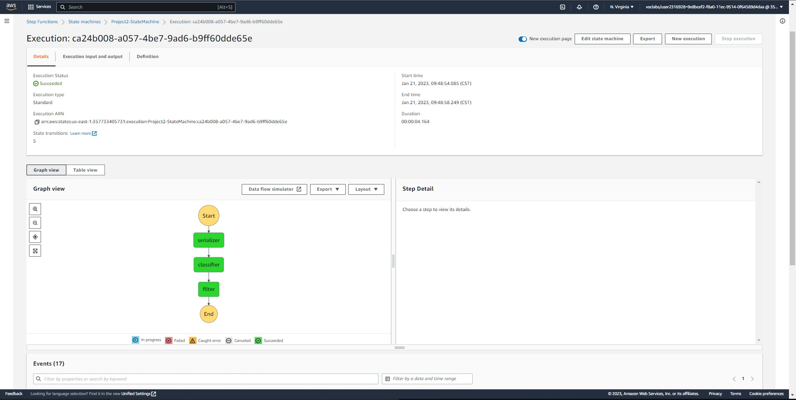
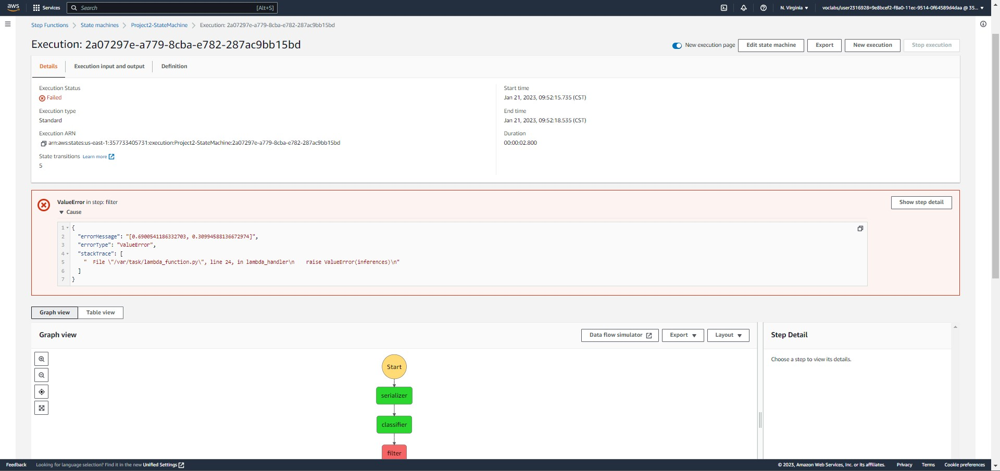
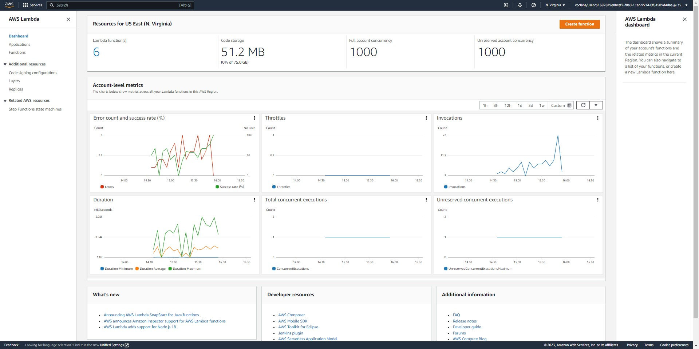

# Report: Build a ML Workflow For Scones Unlimited On Amazon SageMaker
#### Ashley Perez

## Step 1: Data Staging
### What did you learn about image files from the CIPHR dataset? What changes were needed to save the of the images to use to train your model?
A new data definition was learned for pickles. The files from the dataset were pickles, or object hierarchy converted to byte stream, and had to be converted to load. Further, the datasets were split into three, one for meta data, testing data, and training data. The data sets for testing and training were nested dictionaries with information about pixels that would help create images by stacking into numpy arrays. The meta data provided labels to be able to filter these stacks and pre-define which images would be used for model training and testing.

### What was the most challenging part about Data Staging?
Initally, understanding how to filter the model datasets using the meta dataset was unfamiliar. This took some time reading the documentation and visualizing and some experimenting with the nested dictionary structure for each dataset to create filters based on the data labels. 

## Step 2: Model Training and Deployment
### What was configuring and training an image classifaction like?
There was some uncertainty about adding hyperparameters for image classification, however, the default items were used and defined based on the business context/problem. Training the model did not take longer than a couple of minutes and the validation accuracy did top above 0.8.  

### What was the output of a prediction? 
After deploying the model, using the model to predict from a sample image provided a list of two values as a representation of the inference. The first value representing the probability it was a bike and the second representing the probability of the image being a motorcycle. The higher value in the array represented the inference the model made and confidence of inference.

## Step 3: Lambdas and Step Function Workflow
### What Lambda functions were written? How did you expect the output to be received per lambda?
Three lambda functions were written. 
1. The first lambda function was an image serializer. From the dataset, the lambda woud encode the image and pass the information on to the next lambda.
2. The second lambda function was an image classifier. From the output of the first lambda, this function would decode the image, instantiate a predictor, and run an inference about the image and add this to the output.
3. The third lambda was an inference filter. Based on the inference values recieved from the image classifier lambda, if the probability of the inference was not at a specified threshold, the function would return a ValueError.
Based on documentation and examples of lambda tests, the outputs were expected to be JSON files with objects defined by function outputs.

### Was there any additional troubleshooting you had to do to orchestrate the lambda functions into a functioning step function workflow?
We were advised to use a Python 3.8 runtime environment for executing our functions. Further, the sagemaker sdk was required to instantiate the predictor for the model endpoint, so there was some troubleshooting with deploying the classifier lambda as a package to S3 and then uploaded to lambda. Additionally, since it was this version of Python, the numpy package files were binary and had to be compiled before being able to execute the function. There was some troubleshooting with the third lambda function as the payload outputted from the second was in the form of a string. So extracting the float values of the inferences was required before the filter lambda was filtering properly.

## Step 4: Testing and Evaluation
### What was the outcome of your tests peformed on the workflow? Did the outputs behave as expected? 
During testing, with a test image, the model confidence stayed the same, as seen on the plot. As further tests were generated, the threshold was set at 0.8 confidence and most invocations returned a value above this threshold. This is something I would explore further to determine a more explainable confidence acceptability.

### Here are the model inferences plotted by confidence over timestamp

### If given more time for testing to improve your model, where would you focus your attention on? 
More invocation tests would be run and analyzed. Based on the invocation data, some adjustments to the model visualization might be made to better understand invocation patterns for long-term applications and production environments. This might also lead to better understanding of model capability and more explainable threshold limit.

### This is a successful workflow:

### This is a successful workflow and filter returning an error for a value below chosen Threshold:

### Here are model invocation logs over time:

## Summary
By building a model workflow for Scones Unlimited, the process of transforming data, training an image classification model, deploying a model endpoint, and orchestrating the enpoint into a step function workflow was accomplished. There was quite a bit learning within the Sagemaker Studio environment and across AWS services, including for: Lambda functions, S3 buckets, IAM, Step Functions, and CloudWatch. At a high-level the process steps for developing a model and deploying it into production are better understood. Further, image classification domain knowledge is more approachable and provides a valuable reference for how powerful the AWS machine learning platform can be in applying machine learning concepts to real-world problems.
